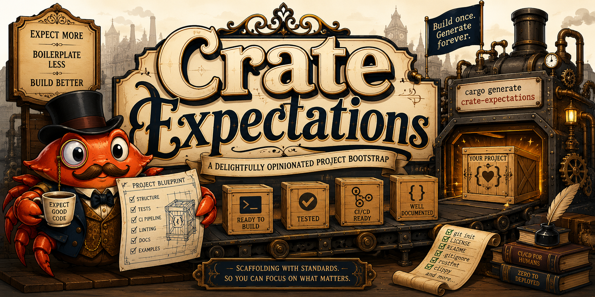

<p align="center">
  
</p>

# Crate Expectations

A [cargo-generate](https://cargo-generate.github.io) template for new Rust
projects. One source generates one of two archetypes, each producing a project
whose `just check` is green from the first commit:

- a **library** — published to crates.io or kept internal, and optionally
  `no_std` and/or security-hardened, or
- an **application** (binary).

Hardening and CI capabilities (Miri, fuzzing, sanitizers, coverage, OSSF
Scorecard, …) are **independent toggles** you mix with either archetype, so a
`no_std` / security-critical library is just a library with the right toggles
set — fuzz a binary, run Miri on an internal lib, and so on.

> [!NOTE]
> **Heads-up — this is my personal template.** Its defaults encode my own
> preferences, and the identity prompts default to my GitHub owner (`qkniep`)
> and contact email. Generating from it directly is fine — just set
> `gh_username` / `email` when prompted (especially under `--silent`, which
> takes the defaults without asking). If you want it as your own long-term
> baseline, **fork it** and adjust the defaults in `cargo-generate.toml`.

## Quick start

```sh
cargo install cargo-generate          # one-time, if you don't have it
cargo generate qkniep/crate-expectations
```

cargo-generate prompts for a project name and the options below, then writes a
ready-to-go project into a new directory of that name.

Run `just check` in the new project before your first push: it generates
`Cargo.lock` (cargo-generate doesn't), which you should commit so the `--locked`
builds in CI are reproducible.

Scripted / non-interactive (answers passed with `-d`, the rest take defaults):

```sh
cargo generate qkniep/crate-expectations \
  --name my-app --silent \
  -d kind=binary -d publish=false -d fuzzing=true
```

## Prompts

| Prompt | Values (default) | Effect |
| --- | --- | --- |
| `kind` | `library` \| `binary` (`library`) | `binary` adds `src/main.rs` (a thin entry point over `src/lib.rs`); a *published* `binary` also ships the cross-platform release workflow. |
| `unsafe_policy` | `forbid` \| `deny` (`forbid`) | Sets `unsafe_code` in `[lints]`. `deny` allows opt-in `#[allow(unsafe_code)]` with justification; `forbid` permits none. |
| `publish` | bool (lib `true`, bin `false`) | Adds crates.io metadata, docs.rs config, the `include` allowlist, release-plz, and (library) SemVer checks. For a `binary` it also gates the cross-platform release workflow, whose tag release-plz cuts. |
| `no_std` | bool (`false`, library only) | Adds `#![no_std]` with an optional `std` feature and a bare-metal target build in CI. |
| `coverage` | bool (`true`) | cargo-llvm-cov + Codecov workflow and badge. |
| `benchmarks` | bool (`true`) | Criterion benches + a compile-check CI job. |
| `bench_gating` | bool (`false`, if benchmarks) | Swaps in CodSpeed's criterion shim and adds a perf-regression workflow. |
| `msrv` | bool (`true`) | CI job that reads `rust-version` from `Cargo.toml` and verifies it. |
| `fuzzing` | bool (`false`) | cargo-fuzz target scaffold + a CI smoke run. |
| `miri` | bool (`false`) | Runs tests under Miri (UB detection) in CI. |
| `sanitizers` | bool (`false`) | ASan/LeakSan/TSan CI matrix. |
| `careful` | `off` \| `weekly` \| `pr` (tracks `unsafe_policy`: `deny`→`pr`, `forbid`→`weekly`) | Runs tests under cargo-careful in CI. `pr` gates every PR; `weekly` is a scheduled sweep on `main`; `off` disables it. |
| `feature_powerset` | bool (`false`) | cargo-hack workflow type-checking every feature combination (mirrors `just hack`). |
| `scorecard` | bool (`false`) | OSSF Scorecard supply-chain analysis workflow (adds a badge when `publish` is also set). |
| `gh_username` | string (`qkniep`) | GitHub owner used in URLs and badges. |
| `email` | string | Contact for `SECURITY.md` and the code of conduct. |
| `description` | string | One-line crate description. |

The crate name comes from `--name` (or a prompt); the author line is filled from
your git/cargo config automatically.

## What every project gets

The always-on core: `cargo fmt` (nightly) · clippy (`-D warnings`) · nextest +
doctests · debug/release builds · `cargo deny` · `cargo machete` · `cargo doc`
(`-D warnings`) · typos · actionlint · SHA-pinned actions (`just unpin` to track
tags instead) · a `just` task runner whose `just check` mirrors CI · Dependabot ·
a synced label set · scheduled RUSTSEC audits ·
issue/PR templates · `SECURITY.md`, `CONTRIBUTING.md`, code of conduct, and
dual MIT/Apache-2.0 licensing.

Everything else is added by the toggles above, each as its own workflow file so
it can be removed by deleting one file.

## How it's laid out

```
template/            # the project that gets generated (holds Liquid placeholders)
  cargo-generate.toml  # prompts + which files get templated
  pre-script.rhai      # prunes files an archetype/capability doesn't use
  ...                  # Cargo.toml, src/, .github/workflows/, docs, ...
.github/workflows/
  template-ci.yml    # this template's own CI (see below)
```

Because the files under `template/` contain `{{ placeholders }}`, they are not a
compilable project on their own. Instead, **`template-ci.yml` generates a
representative matrix of archetypes and runs the full `just check` on each**, so
every combination the template advertises is proven green on every push.

## Maintaining the template

- Edit files under `template/`. Only the paths in `cargo-generate.toml`'s
  `include` list get Liquid substitution; everything else (notably
  `.github/`) is copied verbatim, which is why capability-specific behavior is
  expressed as whole workflow files toggled by `pre-script.rhai` rather than
  inline `` inside YAML.
- Test locally without committing:

  ```sh
  cargo generate --path ./template --name scratch --silent -d kind=binary
  cd scratch && just check
  ```

## License

Licensed under either of [Apache License, Version 2.0](LICENSE-APACHE) or
[MIT license](LICENSE-MIT) at your option.
